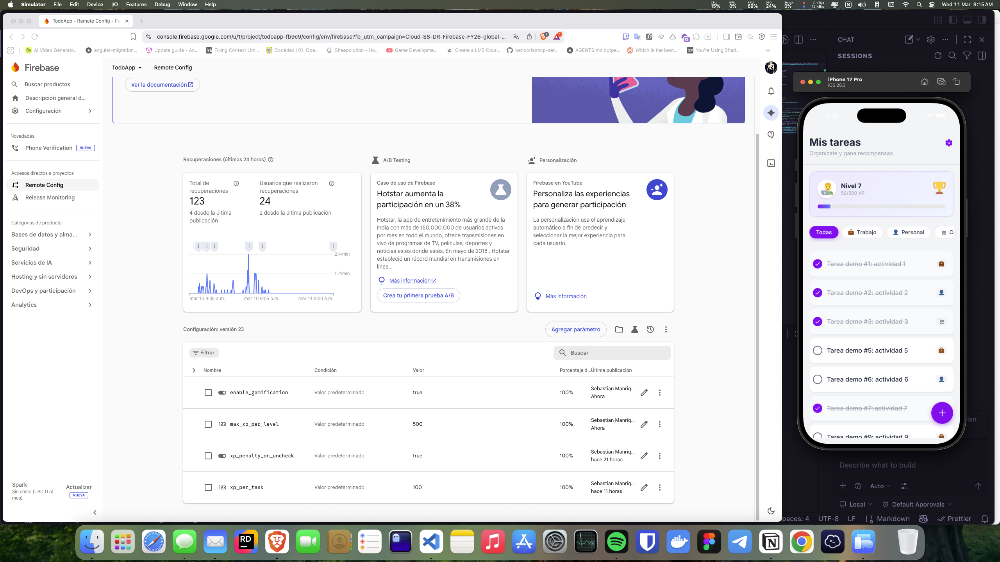
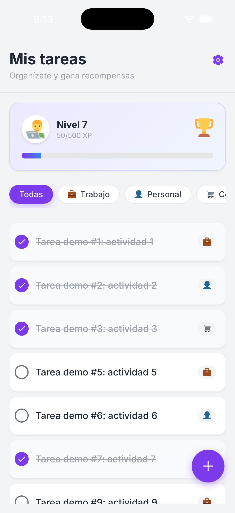
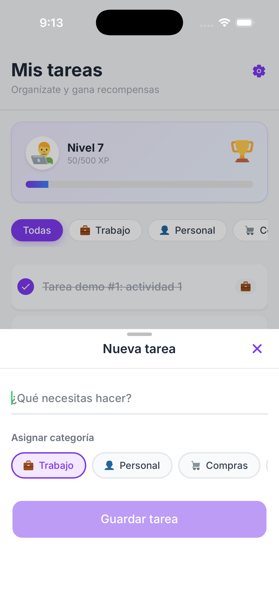
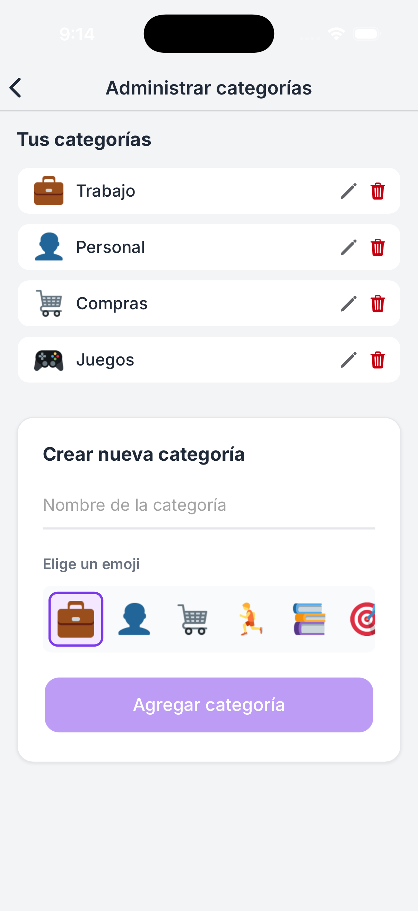

# ToDoApp - Ionic + Angular

Aplicación móvil híbrida para gestión de tareas, construida con Ionic 8 y Angular 20. El proyecto prioriza rendimiento en listas grandes, arquitectura modular y una base mantenible para evolución continua.

## Requisitos Previos

- Node.js 18+
- npm 10+
- Ionic CLI 7+
- Cordova CLI 12+
- Android Studio (para Android)
- Xcode (para iOS, en macOS)

## Pasos de Instalación

1. Clona el repositorio:

```bash
git clone <URL_DEL_REPOSITORIO>
cd ToDoApp
```

2. Instala dependencias:

```bash
npm install
```

3. Ejecuta en desarrollo (web):

```bash
npm start
```

## Pasos para Compilar

### Compilación web

```bash
npm run build
```

Salida: `www/`

### Compilación Android (APK)

```bash
ionic cordova build android
```

APK debug esperado en:
`platforms/android/app/build/outputs/apk/debug/app-debug.apk`

### Compilación iOS (IPA)

```bash
ionic cordova build ios
```

Luego genera el `.ipa` desde Xcode (Archive/Export) abriendo `platforms/ios`.

## Enlaces de descarga de artefactos

- APK: [Descargar APK](https://drive.google.com/file/d/REEMPLAZAR_ID_APK/view)
- IPA: [Descargar IPA](https://drive.google.com/file/d/REEMPLAZAR_ID_IPA/view)

## Demo en video (Google Drive)

[](https://drive.google.com/file/d/1XMhx1Y71cTKhtlqGsXcO18ylZipwsa_B/view)

Video local (evidencia): [`./evidence/demo.mov`](./evidence/demo.mov)

## Vistas principales (móvil)

### Dashboard



### Nueva tarea



### Gestión de categorías



## Respuestas a la prueba técnica

### ¿Cuáles fueron los principales desafíos que enfrentaste al implementar las nuevas funcionalidades?

El reto principal fue integrar Remote Config dentro del flujo de arranque/ciclo de vida de Angular sin afectar la experiencia inicial de la app. También fue clave ajustar Virtual Scroll con datos dinámicos (filtros y cambios de estado) para mantener fluidez con volúmenes altos de tareas.

### ¿Qué técnicas de optimización de rendimiento aplicaste y por qué?

Se aplicó Virtual Scroll para renderizar solo elementos visibles y reducir costo de DOM. Se usó Lazy Loading con `loadComponent` para disminuir carga inicial. Se configuró `OnPush Change Detection` para limitar renders innecesarios. Además, se cuidó la gestión de Observables (desuscripción cuando aplica) para evitar fugas de memoria y degradación en sesiones largas.

### ¿Cómo aseguraste la calidad y mantenibilidad del código?

La arquitectura separa responsabilidades mediante servicios especializados (SRP), modelos tipados con interfaces TypeScript y organización modular por features. Esto facilita pruebas, cambios evolutivos y escalabilidad sin acoplamientos fuertes.
